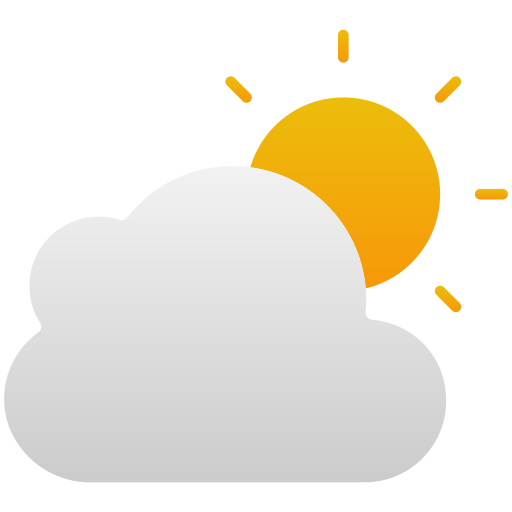

  <h1>
      
      <a href="https://maggyprotasio.github.io/Weatherwoman/">Weatherwoman</a>
  </h1>
  
  <h3>Modern responsive website that shows weather data using Open Weather API</h3>
  
Check out the jokes everytime you search! 

  
  

